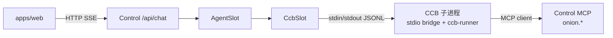

# Agent Slot + CCB stdio（Chat 走可换 Slot）

**日期：** 2026-07-17  
**状态：** Approved（用户确认）  
**上游：** [进程分离设计](./2026-07-17-harness-control-ccb-process-separation-design.md)、[北极星](./2026-07-17-harness-control-console-north-star-design.md)、[Spec 线 T4](./2026-07-17-harness-control-console-spec-line.md)  
**补齐：** 进程分离后 Web Chat 仍直连 LLM、未进 Slot 的缺口（故无 WebSearch 等工具）

## 目标

让主对话路径变为：**Web → Control `/api/chat` → `AgentSlot` →（默认）`CcbSlot` 经 stdio 调 CCB 子进程内 `ccb-runner`**。  
壳只依赖 Slot 接口，便于以后换成其它实现；CCB 工具（含 WebSearch）与洋葱 MCP 热路径保持进程分离边界。

## 已拍板决策

| 主题 | 选择 |
|------|------|
| 主 Agent 入口 | **只经 `AgentSlot`**；`/api/chat` 不得再直连 LLM completions 作为主路径 |
| 默认可换实现 | **`CcbSlot`**：本机子进程 + **stdio** JSON 行协议 |
| 工具执行位置 | **CCB 进程内**（既有 / 迁回的 `ccb-runner` + CCB tools） |
| 权限 | 仍走 **Control MCP** `onion.authorize` / `wait_resolve`；fail-closed |
| Slot 可换含义 | 可换的是 **TS `AgentSlot` 实现**；stdio 只是 CcbSlot 的传输细节 |
| CCB 不可用 | **显式报错**，不静默降级回纯 LLM（避免再次误判「没有 WebSearch」） |

## 非目标

- HTTP / Remote Slot 适配器（以后可另加，不阻塞本切片）
- 多 CCB 池化、跨机 SSH/远程 Agent
- 重做洋葱、Memory、LLM Settings CRUD
- 把产品代码重新塞回 `ccb/harness/**` 大树（仅允许 **stdio bridge + runner** 等薄 Agent 侧代码）

## 架构

### 组件

```text
packages/slot/          ← AgentSlot + SlotEvent（壳唯一依赖）
apps/control/           ← /api/chat → slot；spawn/管理 CCB 子进程
apps/web/               ← 仍消费现有 SSE 事件形状（对齐 SlotEvent）
ccb/                    ← stdio bridge 入口 + ccb-runner（工具循环）
                          + 既有 MCP onion 钩子
```



### 洋葱怎么进 CCB（与「runner 直接跑 tool」不矛盾）

`ccb-runner` **不裁决权限**，只负责 LLM↔tool 循环。每次真正执行 tool 时走 CCB 既有权限入口：

```text
ccb-runner
  → tool.call(..., hasPermissionsToUseTool, ...)
    → permissions.ts（HARNESS_ONION_MCP=1）
      → mcpOnionBridge.authorizeViaMcp
        → Control MCP：onion.authorize
        → 若 needs_confirm → onion.wait_resolve（Web 确认）
    → allow 才继续执行 WebSearch 等；deny / MCP 不可达 → fail-closed
```

要点：

| 层 | 干什么 | 不干什么 |
|----|--------|----------|
| Slot / stdio | 传 turn 与 `SlotEvent` | 不跑洋葱 |
| `ccb-runner` | 调 LLM + `tool.call` | 不本地裁决 L1–L3 |
| `mcpOnionBridge` + `permissions.ts` | MCP client 问 Control | 不实现洋葱链 |
| Control `packages/onion` | 唯一洋葱 runtime | — |

stdio bridge **启动 CCB 子进程时必须**：

1. `HARNESS_ONION_MCP=1`
2. `setControlMcpClient(...)` 注册 BridgeClient；实现上对 **同一 Control HTTP** 调 `/api/agent/onion/authorize` 与 `/wait_resolve`（与 MCP handlers 共用洋葱 runtime）。原因：Control 进程级 MCP 占 stdio，不能与 Chat JSONL 管道共用。
3. 未注册 client → 任何 tool **deny**（已有 fail-closed）

两条通道并存、职责不同：

- **Chat stdio**：Control → CCB（对话 / 事件）
- **Onion HTTP（同 handlers）**：CCB → Control（工具授权；语义等同 MCP `onion.*`）；`bun run dev` 下 Control 始终挂载 `/api/agent/onion`，Chat 工具链不依赖 `HARNESS_MCP=1`

### `AgentSlot` 最小面（本仓）

与旧 worktree `harness/slot/types.ts` 对齐，至少包含：

- `initSession(config)` / `getSession()`
- `sendMessageWithHistory(messages, onEvent, signal?)`
- `abort()`
- （可选本轮）`respondToPermission` — 若 L3 仍完全由 MCP `wait_resolve` + Web pending 完成，Slot 可不暴露权限回调；**本切片默认：权限不经 Slot，只经 MCP**

### `SlotEvent`（与现 Chat SSE 对齐）

- `text-delta` | `tool-call` | `tool-result` | `done` | `error`
- Control 把事件原样（或薄映射）写成现有 `data: {...}\n\n` SSE，避免大改 Web

### CcbSlot ↔ CCB stdio 约定

- **一行一条 JSON**（JSONL）；stderr 仅日志，不承载协议
- Control → CCB 示例：`{ "type": "turn", "id": "...", "messages": [...], "workspaceRoot": "..." }`
- CCB → Control：与 `SlotEvent` 同形，并带 `id` 关联 turn；结束必须有 `done` 或 `error`
- Control → CCB：`{ "type": "abort", "id": "..." }`（与 HTTP abort / `slot.abort()` 对应）
- 进程模型：**Control 懒启动并复用一个长期子进程**（多 turn 共享）；崩溃则下次 turn 重启；并发 turn 用 `id` 区分或本切片先 **串行化**（实现计划里二选一，默认 **串行** 降复杂度）

### CCB 侧

- 新增薄入口（例如 `ccb/src/harness/stdioBridge.ts` 或等价）：读 stdin → 调 `runCCBAgent` → 写 stdout
- `ccb-runner`：从旧 T1 worktree 迁入 CCB fork 的薄目录（**不是**整棵 `ccb/harness` 产品树）
- 启动时挂上既有 Control MCP client（onion）；连不上则工具 fail-closed

### `/api/chat` 行为变更

1. 校验 messages、workspaceRoot、LLM 配置（key 仍可由 runner 读 `.harness/llm.json`）
2. 取默认 `AgentSlot`（factory → `CcbSlot`）
3. `sendMessageWithHistory` → SSE 转发事件
4. 客户端断开 → `abort()`
5. **删除**（或降级到仅测试开关）当前直连 `chat/completions` 主路径

## 错误与边界

| 情况 | 行为 |
|------|------|
| 子进程起不来 / stdio 断 | SSE `error`，文案明确「Agent Slot / CCB 不可用」 |
| turn 超时 | abort 子进程 turn + `error` |
| MCP 不可达 | 工具 deny（既有）；模型侧可见 tool 失败结果 |
| 换 Slot | 改 factory 绑定；`/api/chat` 与 Web 不变 |

## 验收

1. 问「某城市天气」时，链路出现 **WebSearch（或等价联网 tool）** 的 `tool-call` / `tool-result`，且最终回答含实时信息（或明确的 tool 失败原因），不再出现「我无法获取实时天气、请告诉城市」这类纯无工具话术（在 key 与网络正常时）
2. `apps/web` / `apps/control` **不** `import` CCB 内部 `src/tools` 等模块
3. 停掉 Control MCP 或模拟不可达 → 特权/需授权 tool 被拒绝（fail-closed）
4. 换一个 mock `AgentSlot` 实现时，`/api/chat` 无需改路由签名即可跑通假事件流（单测或轻集成）

## 测试策略

- **单测：** JSONL 编解码、`CcbSlot` 对假子进程的 turn/abort
- **单测：** `/api/chat` 在 Slot 返回 `error` 时的 SSE 形状
- **集成（可选本切片）：** 真子进程 + mock LLM 或录制；天气 E2E 可手工验收

## 与既有文档关系

- 进程分离「独立 CCB 进程」：**保留**；本设计明确 Chat 如何接到该进程（stdio，由 Control spawn）
- Spec 线 **T4 极薄 Slot + CCB**：本设计即其进程分离后的落地形态
- 旧 worktree `ccb/harness/slot/*`：接口与 runner 为参考实现；产品壳侧接口落在本仓 `packages/slot`
