# Agent Slot + CCB stdio（Chat 走可换 Slot）

**日期：** 2026-07-17  
**状态：** Implemented（对照本仓当前代码修订）  
**上游：** [进程分离设计](./2026-07-17-harness-control-ccb-process-separation-design.md)、[北极星](./2026-07-17-harness-control-console-north-star-design.md)、[Spec 线 T4](./2026-07-17-harness-control-console-spec-line.md)  
**补齐：** 进程分离后 Web Chat 须经 Slot 进 CCB（工具 / 洋葱 / QueryEngine loop）

## 目标

主对话路径：

**Web → Control `/api/chat` → `AgentSlot` →（默认）`CcbSlot` → stdio → CCB `stdioBridge` → `runCCBAgent` → CCB `ask()` / QueryEngine**

壳只依赖 `packages/slot`；CCB 拥有唯一 agent loop、工具、subagent、schema 与校验重试。

## 已拍板决策

| 主题 | 选择 |
|------|------|
| 主 Agent 入口 | **只经 `AgentSlot`**；`/api/chat` 不直连 LLM completions |
| 默认可换实现 | **`CcbSlot`**：本机子进程 + **stdio** JSONL |
| Agent loop | **仅 CCB** `ask()` → `QueryEngine` → `query()`（与 ACP / `-p` 同路径） |
| Slot / runner | **无 loop**：只 bootstrap + SDKMessage→SlotEvent 投影 |
| 工具执行 | CCB 进程内 `tool.call`；权限经洋葱 |
| Subagent | **完全在 CCB 内**；外层不转发 `parent_tool_use_id` |
| 权限 | Control onion HTTP（`authorize` / `wait_resolve`）；fail-closed；**不经 Slot** |
| CCB 不可用 | 显式 SSE `error`，不静默降级纯 LLM |

## 非目标

- HTTP / Remote Slot 适配器
- 多 CCB 池化、跨机 Agent
- 外层展示 / 编排 subagent 嵌套 UI
- 调用 `runHeadless`（会污染 Chat JSONL stdout）
- 把产品壳重新塞回 `ccb/harness/**` 大树

## 架构

### 组件（当前落点）

```text
packages/slot/                 ← AgentSlot + SlotEvent
apps/control/src/slot/         ← CcbSlot、factory、jsonl
apps/control/src/http/routes/  ← /api/chat → slot SSE
apps/web/                      ← ChatPanel 消费 SSE；会话持久化含 toolCalls
ccb/src/harness/
  stdioBridge.ts               ← JSONL 协议
  ccb-runner.ts                ← bootstrap + ask()
  mapSdkToSlot.ts              ← SDKMessage → SlotEvent（滤掉 subagent）
  mcpOnionBridge.ts            ← 洋葱 HTTP client 钩子
```



```mermaid
flowchart LR
  Web["apps/web"]
  Chat["Control /api/chat"]
  Slot["AgentSlot"]
  CcbSlot["CcbSlot"]
  Bridge["stdioBridge"]
  Runner["runCCBAgent"]
  QE["ask / QueryEngine / query"]
  Onion["Control onion HTTP"]

  Web -->|HTTP SSE| Chat
  Chat --> Slot
  Slot --> CcbSlot
  CcbSlot -->|JSONL| Bridge
  Bridge --> Runner
  Runner --> QE
  QE -->|tool.call + permissions| Onion
```

### 职责分层

| 层 | 干什么 | 不干什么 |
|----|--------|----------|
| Slot / CcbSlot | turn 进、SlotEvent 出、abort | 无 agent loop、无 subagent 编排 |
| `stdioBridge` | JSONL 编解码、turn 终态 | 不调 LLM |
| `ccb-runner` | env / tools / commands / agents bootstrap；调 `ask()`；映射事件 | 不 DIY OpenAI tool 环；不裁决洋葱 |
| QueryEngine / `query.ts` | schema、工具循环、校验重试、commands、**subagent** | — |
| onion bridge + Control | L1–L3 授权 / 确认 | — |

### 洋葱（与 loop 分离）

```text
ask() / toolExecution
  → hasPermissionsToUseTool
    → HARNESS_ONION_MCP=1 时 authorizeViaMcp
      → Control HTTP：/api/agent/onion/authorize
      → needs_confirm → wait_resolve（Web ConfirmBanner）
    → allow 才执行；deny / 不可达 → fail-closed
```

启动 CCB 子进程须：`HARNESS_ONION_MCP=1` + 注册 HTTP BridgeClient（Chat 占 stdio，洋葱走 HTTP）。

### Agent loop（唯一）

`runCCBAgent`：

1. 读 `.harness/llm.json` → 写 OpenAI 兼容 env（若 provider=openai）
2. `enableConfigs`、`getTools`、`getCommands`、`getAgentDefinitionsWithOverrides`
3. `ask({ includePartialMessages: true, canUseTool: hasPermissionsToUseTool, agents, commands, ... })`
4. `mapSdkToSlot`：顶层 `text-delta` / `tool-call` / `tool-result` / `done` / `error`
5. **丢弃**带 `parent_tool_use_id` 的事件（subagent 仅 CCB 内部）

历史：`messages.slice(0,-1)` → `mutableMessages`；最后一条 user → `prompt`。

### `AgentSlot` 面

- `initSession` / `getSession`
- `sendMessageWithHistory(messages, onEvent, signal?)`
- `abort(signal?)` — 仅 abort **本 signal 拥有的** in-flight turn（避免排队断开误杀）
- 权限确认 **不**经 Slot（Web pending + onion wait_resolve）

### `SlotEvent`

- `text-delta` | `tool-call` | `tool-result` | `done` | `error`
- `tool-call.toolCall`：`{ id, toolName, input, output?, status }`（`status` 含 `error`）
- 仅顶层 tool；无 `parentToolUseId`

### CcbSlot ↔ stdio

- JSONL；stderr 仅日志
- → `{ type: "turn", id, messages, workspaceRoot }`
- ← SlotEvent + `id`；必须 `done` 或 `error` 收尾
- → `{ type: "abort", id }`
- 长期子进程复用；turn **串行**

### Web / 会话（当前行为）

- ChatPanel：tool 区在正文上方；output **默认折叠**
- 会话 PUT/GET 持久化 assistant `toolCalls`（刷新后仍可见）
- Headless auto-allow 等仍走既有 Settings，与 Slot 正交

### `/api/chat`

1. 校验 messages / workspace
2. factory → 默认 `CcbSlot`
3. SSE 转发 SlotEvent
4. 断开 → 作用域内 `abort(signal)`
5. 无直连 completions 主路径

## 错误与边界

| 情况 | 行为 |
|------|------|
| 子进程 / stdio 失败 | SSE `error`（Agent Slot / CCB 不可用） |
| turn abort | 终态 `error`（必要时再 `done`，见 stdioBridge 终态约定） |
| 工具校验 / 执行失败 | 顶层 `tool-call` `status: error` + 可读 output；QueryEngine 内可重试 |
| 洋葱不可达 | tool deny |
| Subagent 内部失败 | 外层不可见细节；体现在父级 Agent tool 结果中 |

## 验收（对照当前实现）

1. Chat 经 Slot→CCB；天气等场景可出现顶层联网 tool（或明确 tool 失败），非整段「无工具」话术
2. `apps/web` / `apps/control` 不 import CCB `src/tools`
3. 洋葱 fail-closed 仍成立
4. mock `AgentSlot` 可换（factory 单测）
5. **无** DIY OpenAI tool loop；stderr 可见 `ask() with N tools…`
6. 刷新后会话仍保留 `toolCalls`
7. 外层 UI **无** subagent 嵌套树

## 测试

- `ccb/src/harness/__tests__/`：mapSdkToSlot（含「不转发 subagent」）、abort、onion HTTP、formatToolResult
- Control：chat-sessions 含 toolCalls 持久化；CcbSlot / factory 单测
- 天气 E2E：手工（需 LLM + 搜索 key）

## 与既有文档

- 进程分离：保留；本文件为 Chat 接入形态的 **现行** 说明
- Spec 线 **T4**：本设计即落地；loop 产品化 = 已接 `ask()` / QueryEngine
- 子文档 [query loop](./2026-07-17-harness-ccb-query-loop-design.md)：loop 边界摘要（细节以本文为准）
