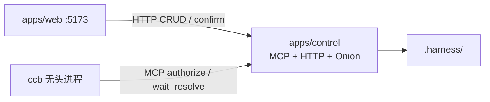

# Harness ↔ CCB 进程分离（洋葱经 MCP）

**日期：** 2026-07-17  
**状态：** Approved（对话确认 §1–§3）  
**上游：** [北极星架构](./2026-07-17-harness-control-console-north-star-design.md)、[Spec 线](./2026-07-17-harness-control-console-spec-line.md)  
**取代：** [T1 实现计划](../plans/2026-07-17-harness-t1-onion-web-shell.md) 中「全部产品代码放进 `ccb/harness/`」的仓库布局（该 plan 的目标能力仍有效，**布局与进程模型以本文为准**）

## 目标

把 `http://localhost:5173/` 所代表的 **Web 壳与中控产品代码** 从 CCB submodule 中拆出：本仓拥有 Control + Web + 洋葱；`ccb/` 只保留无头 Agent 与极薄 MCP 钩子；两边 **不共享产品源码目录**，只靠协议通信。

## 已拍板决策

| 主题 | 选择 |
|------|------|
| 仓库边界 | 本仓 = 产品；`ccb/` = submodule / 独立 fork；协议通信 |
| 洋葱裁决位置 | **全在本仓 Control**；CCB 不做本地洋葱 runtime |
| Control 不可达 | **Fail-closed**：一律拒绝 tool |
| 热路径通道 | **Project Control MCP**（含 `onion.authorize`） |
| L3 确认 | **异步两段**：`authorize` → `needs_confirm`；CCB 再调 `onion.wait_resolve`；Web 确认后返回 |
| 现有 `ccb/harness/` | **一次搬清**到本仓；submodule 内删除产品树 |
| 进程拓扑 | **单进程 Control**（MCP + HTTP + 洋葱 + `.harness` I/O）+ 独立 Vite Web + 独立 CCB 进程 |

## 非目标

- 多 Control 集群、企业 SSO
- 非 Web 客户端（Electron / RN）首发
- 把 CCB Ink/REPL UI 搬进本仓
- 本切片内完成满血 Agent loop 产品化（仍属后续 T4 等）

## 架构

### 进程与仓库布局

```text
harness-console/                    ← 本仓（产品）
  apps/web/                         ← Vite React（:5173）Chat|Settings
  apps/control/                     ← Bun：MCP + onion + HTTP API + .harness I/O
  packages/onion/                   ← 洋葱 runtime（仅 control 引用）
  packages/protocol/                ← MCP tool schema / 共享类型
  ccb/                              ← submodule：无头 Agent + 极薄钩子 ONLY

.harness/                           ← Workspace 落盘（由 control 读写）
```



### CCB fork 允许留下的

- `canUseTool`（或等价钩子）→ MCP client：先 `onion.authorize`，若 `needs_confirm` 再 `onion.wait_resolve`
- Control MCP endpoint 连接配置
- **禁止：** `ccb/harness/**` 产品逻辑、Web、本地洋葱裁决、契约审计写盘

### 数据流（tool 热路径）

1. CCB 即将执行 tool → MCP `onion.authorize`（`toolName`、`input`、`sessionId`、上下文）
2. Control 加载 `.harness/contract-onion.json`，跑洋葱链
3. 返回：`allow` | `deny` | `needs_confirm` + `requestId` + 展示文案
4. 若 `needs_confirm`：Control 登记 pending，经 SSE/WS 推到 Web；CCB 调用 `onion.wait_resolve(requestId)`（长轮询/挂起，直到有结果或超时）
5. 用户在 Web 提交允许/拒绝 → Control HTTP 写入该 pending 的结果 → `wait_resolve` 返回
6. CCB 按结果继续执行或取消
7. 每次 authorize / wait_resolve 完成由 **Control** 写入 `.harness/audit/`

CCB 始终是 MCP **client**；不依赖 Control→CCB 的反向推送通道。

### Fail-closed

MCP 连不上、超时、或协议错误 → CCB **拒绝**该 tool，**不**回退到 CCB 本地默认权限。

## MCP 工具面（热路径）

| Tool | 方向 | 作用 |
|------|------|------|
| `onion.authorize` | CCB → Control | 裁决；出参含 `allow` / `deny` / `needs_confirm` + `requestId` |
| `onion.wait_resolve` | CCB → Control | 对某 `requestId` 挂起直至 Web 确认或超时；出参 `allow` / `deny` |

配置面（洋葱 CRUD、章程、pending 列表、用户确认提交）由 Web → Control **HTTP**（T1 足够）；与热路径 MCP 同属 Control 进程，不经过 CCB。

## 迁移清单

| 现位置（worktree `ccb/harness/`） | 新位置 |
|----------------------------------|--------|
| `web/client/**` | `apps/web/` |
| `web/server.ts` + `routes/api/**` | `apps/control/` |
| `onion/**` | `packages/onion/` |
| `bootstrap/**`、`.harness` 读写 | `apps/control/` |
| mcp / authz / headless / memory / llm / … | 优先 `apps/control/`；可复用逻辑再抽到 `packages/*`，不再进 submodule |

删除：`ccb/harness/**` 产品树。

### 本仓脚本（示意）

- `bun run web:dev` → Vite `:5173`
- `bun run control:dev` → Control（MCP + HTTP）
- `bun run agent:dev` → 启动 CCB 无头并挂上 Control MCP（fail-closed）

## 验收标准

1. `:5173` 应用源码不在 `ccb/` 目录树下
2. 断开 Control → CCB 任意 tool 调用均被拒绝
3. L3：`authorize` → Web 确认 → `wait_resolve` 返回 allow → 才执行
4. Settings 修改洋葱 → 只经 Control 写 `.harness`；后续 `authorize` 立即使用新链
5. `ccb/` 内无洋葱业务实现（仅 MCP 调用薄钩子）

## 错误处理

| 情况 | 行为 |
|------|------|
| Control / MCP 不可达或超时 | CCB deny（fail-closed） |
| 洋葱链为空 | 拒绝特权调用（继承 Spec 线 T1） |
| `requestId` 未知或已过期 | Control 拒绝 resolve；CCB 侧视为 deny |
| 用户关闭确认 UI 未操作 | `wait_resolve` 默认 **60s** 超时 → deny；超时可配置 |

## 测试要点

- **单元：** `packages/onion` 链组合、空链拒绝、L1/L2/L3 分支
- **集成：** Control MCP `authorize` → pending → HTTP confirm → `wait_resolve` 返回 allow/deny
- **契约：** Control 宕机时 CCB hook 返回 deny（不执行 tool）
- **回归：** Web Settings CRUD 只打 Control HTTP，不 import `ccb/`

## 与 Spec 线关系

- 将原「T1 代码挂在 `ccb/harness/`」改为「T1 能力在本仓 `apps/*` + `packages/*`；CCB 仅钩子」
- 原 T2「Project Control MCP + 每次 tool 过洋葱」的进程边界 **提前并入本设计**；后续 T2 Spec 聚焦 AuthZ / 远程暴露，不再重新讨论「洋葱是否在 CCB 内」
