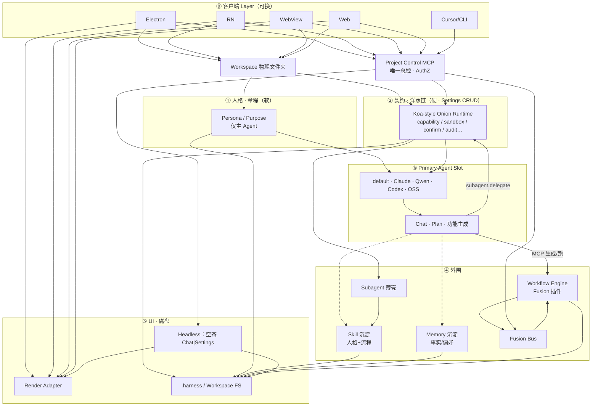

# Harness 中控台 — 北极星架构

**日期：** 2026-07-17  
**状态：** Approved  
**产品：** 全新独立中控台项目  
**范围：** 仅对齐架构。各子系统后续单独出 spec 与实现计划。  
**边界：** 与 Agent Flow Desktop **无关** — 无代码依赖、无迁移路径、不以该产品为参考实现。

## 目标

定义新产品的**北极星架构**：跨设备的**中控台**。

**三层心智模型**：**人格（软）→ 契约（硬）→ 沉淀（Memory + Skill）**。

- **人格**：Workspace 章程中的主 Agent 人格；专职人格在 Skill。  
- **契约**：可编辑的 **洋葱中间件链**（类 Koa：请求外→内→外）；每次工具/特权调用必须穿过整链。每一层是一条限制/沙箱判断；用户（及主 Agent 经 MCP）可在 **Settings 中增删改与排序**。Harness 只提供洋葱**运行时**与审计，具体限制不焊死在代码里。  
- **沉淀**：使用中落下 — **Memory** + **Skill**；都不能绕过契约链。

**Subagent** 为薄壳，靠 Skill 获得专职行为。客户端 Layer 可换（Electron / RN / WebView / 纯 Web）。唯一总控 **Project Control MCP**。空态仅 Chat + Settings。默认 LLM DeepSeek。全新独立仓库。

## 决策

| 主题 | 选择 |
|------|------|
| 本文产出 | 北极星架构（不是单一垂直实现切片） |
| 与其它产品关系 | 与 Agent Flow Desktop 无关 |
| 仓库 | 全新独立仓库 |
| 心智分层 | **人格 → 契约 → 沉淀（Memory + Skill）** |
| 客户端层 | **可替换薄层**：Electron / React Native / WebView App / 纯 Web |
| 用户最上层 | **Workspace 章程**（主 Agent 人格/用途等软上下文；用户或主 Agent 可改） |
| 人格与流程 | 主人格在章程；专职 **Skill**；Subagent 薄壳 |
| 沉淀 | **Memory**（记得什么）+ **Skill**（怎么做/扮谁）；使用中可自动/半自动生成 |
| 硬核层 | **洋葱契约运行时**（不可被 Prompt/Memory/Skill 绕过）；**链上各层用户可 CRUD** |
| 契约编辑 | Settings：**添加 / 编辑 / 删除 / 排序** 限制与沙箱层；主 Agent 经 MCP 亦可改（硬层变更建议确认） |
| 可替换性 | 客户端 · 主 Agent · Skill · Memory · 契约层内容 · 插件 · Render Adapter 可换；洋葱运行时 + MCP 协议稳定 |
| 主 Agent | **Primary Agent Slot**；default / Claude / Qwen / Codex / OSS；只经 MCP |
| Subagent 触发 | **A：MCP `subagent.delegate`** |
| 控制面 | **Project Control MCP** |
| MCP 暴露 | 可远程 + AuthZ |
| 扩展模型 | 客户端 → 人格/章程 → 契约硬核 → Memory/Skill 沉淀 → Fusion |
| 最小内核 | 章程 + **洋葱契约运行时** + MCP + Fusion + Headless + Agent Slot + Skill + Subagent + Memory 接口 |
| 空态 UI | Header 仅 **Chat**、**Settings** |
| 默认 LLM | **DeepSeek** |
| 功能生成 | Chat → Plan/澄清 → 授权 → Fusion + Headless UI |
| Workflow 编排 | **Fusion 插件（Workflow Engine）**；非内核。主 Agent 经 MCP 创建/编辑/运行；步骤调用穿洋葱，可调 Skill / `subagent.delegate` |

## 非目标（本文）

- 实现新仓库或交付某一客户端的完整产品化（Electron/RN/Web 任选其一作首发即可）。
- 敲定完整 MCP tool schema 目录或传输格式。
- 永久绑定某一 LLM 厂商或某一客户端框架。
- 完整身份联邦 / 企业 SSO 产品。
- 插件市场 UX（超出「契约以后可继续加」）。

## 架构

### 总览图（落地版）



### 分层一览

```text
⓪ 客户端 Layer          Electron | RN | WebView | Web | 远程 MCP 客户端
① 人格（章程）           Persona / Purpose —— 软，主 Agent
② 契约（洋葱）           Settings 可增删改排序 —— 每次调用必过
③ Agent Slot             可换适配器；工具只挂 MCP；默认 LLM DeepSeek
④ 外围                   Skill · Memory · Subagent · Fusion · Workflow 插件
⑤ Headless + FS          空态 Chat|Settings；磁盘为真相
```

**心智：** 人格 → 契约 → 沉淀（Memory + Skill）；Workflow 是 Fusion 上的编排插件，不是内核。

**像小龙虾：** 中间 Agent + 外围 Skill/工具；**多出来的：** 可编辑洋葱契约、MCP 中控、可换客户端/适配器、Headless UI。
### 契约层级

1. **Workspace 章程（主要约束主 Agent）**  
   - 初始化必载；用户或 Primary Agent（经 MCP）可改。  
   - **作用范围**：章程的人格/用途等软内容**只注入 Primary Agent**；不自动成为每个 Subagent 的人设。  
   - **硬禁令**仍通过白名单对 **Primary + 所有 Subagent** 强制生效（安全不因子代理而放松）。  
   - 分节：人格/哲学、角色与用途、内容策略（软）。  
   - **硬限制不放在章程长文里作为第二真相**；统一进契约洋葱（Settings 可编辑）。  
   - 每 Workspace 一份章程。

2. **Harness 硬核 = 洋葱契约运行时（类 Koa）**  
   - 每次特权/工具调用：`外层 → … → 内核执行 → … → 外层`（可在前后做 deny / ask / allow / 改写 / 审计）。  
   - **链上各层**（限制与沙箱判断）持久化在 Workspace；**Settings 可添加、编辑、删除、排序**；主 Agent 经 MCP 亦可改。  
   - 出厂附带默认层（如能力门控、审计）；用户可改掉，但**不能关掉洋葱运行时本身**（无链则拒绝执行）。  
   - 层类型示例：`capability-gate`、`path-sandbox`、`network-allowlist`、`require-confirm`、`deny-pattern`；具体 schema 子 spec 定。  
   - MCP / AuthZ / 审计挂钩在运行时；Prompt / Memory / Skill **不可绕过**整链。

3. **Skill 包（人格 + 流程 · 沉淀之一）**  
   - 承载专职人格 + 可复用流程；Primary/Subagent 可加载。  
   - 使用中可由主 Agent 提议生成/演进，经 MCP 落盘（用户可改）。  
   - **前端技能分类（对应架构层）：**
     - **⓪⑤ UI 层** — CSS 实践（BEM 命名、Grid/Flexbox、rem/px 单位、z-index 具名规范）、图片优化（懒加载/BlurHash/srcset/CDN 裁剪）、字体加载（unicode-range、CJK 子集化、font-display）
     - **① 人格层** — React 组件设计（命名 hooks、ErrorBoundary、Suspense、组件拆分决策）、Next.js Hydration 安全（客户端/服务端边界、列表 key、browser API 隔离）
     - **② 契约层** — 前端安全（XSS/CSRF/CSP/CORS/IDOR/postMessage 域名白名单）、DTO Mapper 转换（API 原始响应 → UI 就绪 DTO）
     - **③④ 数据/外围** — Axios/Fetch 约定（拦截器、取消、重试、SSE 流、httpOnly cookie）、API Codegen（OpenAPI/GraphQL → TS 类型 + hooks）
     - **全层横切** — 前端监控（错误上报、行为打点、Web Vitals、Sentry）、国际化（ICU 格式、locale 路由）、JS/TS 编码约定、Vite/Webpack 工程化、Monorepo 约定
     - **移动端** — RN SafeArea/Keyboard、OTA 更新、WebView 性能、Expo 原生模块、UniApp 分包  

4. **Memory（事实/偏好 · 沉淀之二）**  
   - 跨会话「记得什么」：偏好、决策、项目事实等；**不是**整包流程（流程归 Skill）。  
   - 主 Agent 运行前可注入 recall；运行后可 store（经 MCP；失败不阻断主任务）。  
   - 实现可换（自研或外部 Memory 服务）；接口挂在硬核下，**服从白名单与 AuthZ**。  
   - 与章程关系：Memory 可建议改章程/Skill，但不能覆盖硬禁令。  

5. **Subagent（薄壳）**  
   - 运行时 = 壳 + Skill + 硬核/白名单；可经 Memory 获得上下文，但人设仍以 Skill 为主。  

5b. **Workflow Engine（Fusion 插件 · 编排）**  
   - **不是**最小内核；以 Fusion 契约插件形式挂载，可卸可换。  
   - 职责：多步图（节点/边/门控/可恢复运行）的创建、编辑、执行；持久化在 Workspace。  
   - 主 Agent 经 Project MCP 生成/修改/启动 workflow（对齐「功能生成」）。  
   - 每一步的工具/Skill/Subagent 调用仍必须穿过 **契约洋葱**。  
   - 与 Skill 区别：Skill = 可复用单包「人格+流程」；Workflow = 持久编排图。  
   - Headless 可贡献设计器/运行面板（由插件注册）。  

6. **Subagent 触发**  
   - 仅 MCP `subagent.delegate`；description 匹配或用户点名；可选每次确认。  

7. **主 Agent 适配器（Claude / Qwen / Codex …）**  
   - 工具面只挂 Project MCP（含 delegate、Memory、Skill、章程）；禁用或桥接厂商原生 subagent。  

8. **原则**  
   - **人格 → 契约 → 沉淀（Memory + Skill）；客户端/主 Agent 可换；委派与记忆只经 MCP；契约不可绕过。**

### 参考（不绑定厂商实现）

- **行为分层**：OpenAI [Model Spec](https://github.com/openai/model_spec)。  
- **硬门控**：Claude Code [permissions](https://code.claude.com/docs/en/permissions) / [sandbox](https://code.claude.com/docs/en/sandboxing.md)。  
- **项目指导**：Codex `AGENTS.md` → Workspace 章程。  
- **Skill**：各家 SKILL.md 形态；人格可写在 Skill。  
- **Memory**：长期记忆层（实现可选）；与 Skill 职责分离。  
- **Subagent**：Claude `Agent` / Codex `spawn_agent` → MCP `subagent.delegate`。

### 方案理由

- 用户心智：先是人，再是规矩，再用出来的记忆与技能。  
- Memory 与 Skill 拆开，避免「记事」和「可复用流程」糊成一团。  
- 换引擎/客户端不推翻沉淀与委派协议。

## 组件

| 单元 | 职责 | 不做 |
|------|------|------|
| **Workspace 章程（Charter）** | 主 Agent 人格/用途等软上下文；用户/主 Agent 可改 | 绕过洋葱链 |
| **Contract Onion（契约链）** | 有序中间件层：限制/沙箱判断；Settings CRUD+排序；调用必经 | 关闭运行时；层内提权绕过外层 |
| **Skill 包** | 沉淀：人格 + 流程；按架构层分类（ui/persona/contract/data/crosscut/mobile） | 绕过洋葱；代替 Memory |
| **Memory** | 沉淀：事实/偏好/决策 | 覆盖契约层 |
| **Subagent（薄壳）** | 委派单元；绑定 Skill；调用同样穿洋葱 | 自带完整人设；旁路 MCP |
| **Onion Runtime** | Koa 式执行引擎 + 审计钩子 | 绑定某一 LLM/客户端 |
| **WorkspaceBootstrap** | 选文件夹；加载章程 + manifest；绑定会话 | 解释业务插件 |
| **Project Control MCP** | 唯一控制面；执行顶级契约下的认证、鉴权、审计、工具聚合 | 承载业务逻辑 |
| **AuthZ** | 主体 × 能力 × workspace 作用域（本地 + 远程） | 完整 IdP / SSO 产品 |
| **AuthZ** | 主体 × 作用域（本地+远程）；与洋葱层叠加 | 完整 IdP 产品 |
| **Fusion Bus** | 次级契约 CRUD、生命周期、贡献点、可视化编辑 | 绕过洋葱 / MCP |
| **Workflow Engine（Fusion 插件）** | 多步编排图的 CRUD/运行；步骤经洋葱调 Skill/Subagent | 进入最小内核；绕过洋葱或 MCP |
| **Headless UI Runtime** | 校验 type/layout JSON；合成壳/页/面板；named views | 直连远程 MCP |
| **Client Layer** | Electron / RN / WebView / 纯 Web；呈现与输入；连接 MCP | 内嵌业务内核；旁路 MCP |
| **Render Adapter** | 把 Headless 描述渲到当前客户端 UI 栈 | 写死单一客户端框架为内核 |
| **Agent Slot** | 次级：Primary Agent 接口与绑定；Chat 只依赖 Slot | 解除 Harness 顶级限制 |
| **默认 Primary Agent 实现** | 出厂 Slot 绑定（可卸）；澄清/Plan/编排/生成功能；只调 MCP | 等同于顶级契约本身 |
| **Claude / Qwen / Codex / OSS 适配器** | 实现 Agent Slot：模型对话；**工具只来自 Project MCP**（含 subagent.delegate） | 用厂商原生 subagent 旁路本产品；绕过 MCP / 白名单 |
| **Tool Providers** | 原生 MCP 工具或 CLI 委派 | 无白名单仍可运行 |
| **Plugin（Fusion 实现）** | 贡献 tools/views/tabs/actions | 调用内核私有 API；绕过顶级契约 |

### 内建贡献（非业务插件）

- `shell.chat` — Chat（对话对象 = 当前 Agent Slot 绑定）  
- `shell.settings` — Settings（章程、**契约洋葱 CRUD/排序**、LLM、Primary Agent、远程、Fusion）  
- `contract.onion` — 契约链文档（用户可增删改排序）  
- `workspace.charter` — 章程（约束主 Agent；硬禁令全员）  
- `skill.*` — Skill 沉淀（人格 + 流程），按架构层分类：
  - `skill.ui.*` — UI 层（CSS 实践、图片优化、字体加载）
  - `skill.persona.*` — 人格层（React 组件设计、Next.js Hydration 安全）
  - `skill.contract.*` — 契约层（前端安全、DTO Mapper）
  - `skill.data.*` — 数据层（HTTP 约定、API Codegen）
  - `skill.crosscut.*` — 横切（前端监控、国际化、编码约定、工程化）
  - `skill.mobile.*` — 移动端（RN、WebView、Expo、UniApp）  
- `memory.*` — Memory 沉淀（recall/store；实现可换）  
- `subagent.*` — Subagent 薄壳  
- `subagent.delegate` — MCP 委派  
- `agent.default` / `agent.claude` / `agent.qwen` / `agent.codex` / `agent.<oss>` — Slot 适配器  
- `workflow.*` — Workflow Engine 插件（编排；可选安装）  
- `fusion.editor` — 次级契约可视化  

### 契约洋葱（Settings 可编辑）

- 持久化：例如 `.harness/contract-onion.json`（有序层列表）。  
- Settings UI：列表展示每层（类型、名称、参数、启用否）；支持 **添加 / 编辑 / 删除 / 拖拽排序**。  
- 调用路径：`tool 请求 → onion.inbound… → 执行 → onion.outbound… → 结果`；任一层 `deny` 则中止并审计。  
- 出厂默认层可删可改；若用户删光所有层，运行时仍在，但处于「拒绝一切特权调用」的安全默认（或强制保留一条最小审计层——子 spec 二选一，推荐：**强制保留不可删除的 `audit` 层**，其余可删）。  
- 章程里的「硬禁令」可编译为洋葱中的一层，或 Settings 里直接以层表达；避免两套真相——**推荐洋葱为唯一硬限制源**，章程只保留人格/用途等软内容。

## 数据流

### 冷启动（空 Workspace）

1. 用户选择物理 Workspace 文件夹。  
2. Bootstrap 加载章程 + **契约洋葱** + 壳 UI。  
3. Client 渲染 Header，仅 Chat | Settings。  
4. 无业务插件 → 无额外 Tab/面板；Chat 上下文已含章程。

### Chat → 委派 Subagent

1. Primary（任意适配器）决定委派，或用户点名。  
2. 调用 MCP `subagent.delegate`（skillId + 任务）；可选用户确认。  
3. 硬核跑洋葱链 → 通过后启动薄壳 + Skill。  
4. 摘要回 Primary；审计记录。  
5. 换 Claude/Qwen/Codex 适配器后步骤不变。

### Chat → 生成功能

1. 用户在 Chat 描述需求。  
2. 当前 Primary Agent（任意 Slot 适配器）澄清 / Plan。  
3. 若洋葱层要求确认/缺能力 → Chat 授权卡或 Settings 改链。  
4. 经 Project MCP（每次调用穿洋葱）：  
   - 原生工具和/或可选 `claude`/`codex` 委派（白名单门控）。  
   - Fusion：创建/更新新功能的契约。  
   - Headless UI：写入/更新页面/面板 JSON → Shell 出现新 UI。  
5. 持久化到 Workspace 磁盘（真相源）。  
6. 远程客户端走同一 MCP 路径，带各自主体的 AuthZ。

### Settings 路径

- 开关/编辑 **契约洋葱**（增删改排序）、编辑章程、LLM、Primary Agent、Fusion、远程 — 经 MCP。  
- Primary Agent 改洋葱硬层：默认需用户确认。

## 错误处理

| 场景 | 行为 |
|------|------|
| 洋葱层 deny | 不执行；提示原因；可引导去 Settings 改层 |
| 洋葱链为空/无效 | 拒绝特权调用（或仅保留强制 audit 层） |
| 远程 AuthZ 失败 | 拒绝；写审计 |
| 契约层 / UI JSON 校验失败 | 不应用该层；Settings 标错 |
| 外部 CLI 缺失或失败 | 回退原生工具或明确失败（禁止静默） |
| 插件崩溃 | 隔离；Shell 与其它契约继续运行 |
| Primary Agent 连不上 MCP | Chat 显示降级态；禁止本地旁路 |

## 测试（北极星验收主题）

以下是给后续计划用的架构验收主题，不是单次 PR 的完整测试矩阵。

1. 空 Workspace → 仅 Chat + Settings；章程已加载。  
2. Settings 可对契约洋葱 **增删改排序**；保存后下次调用立即按新链执行。  
3. 洋葱 deny 的调用被阻断；审计可查。  
4. Agent 无法不经 MCP 改洋葱/章程。  
5. Primary Agent 除经 Project MCP 外不能改 Fusion/FS；可替换绑定后仍守章程 + 硬核。  
6. 功能生成：新契约 + UI 出现，且可移除/停用。  
7. 远程：有权成功 / 无权失败；审计可读。  
8. 换 Claude/Codex/OSS 后仍加载同一章程且硬核仍生效。

## 成功标准

- 读者能说清：**人格 → 可编辑洋葱契约 → 沉淀**；Settings 可 CRUD 限制层。  
- Memory 与 Skill 分离；都不能绕过洋葱。  
- 换客户端/主 Agent 适配器不改洋葱协议。  

## Skill 分类体系（对应北极星架构层）

前端技能按北极星架构分层组织，每层技能服务对应架构层的职责：

```text
⓪ 客户端 Layer ─────────────────────────────────────────────
│  skill.mobile.*          RN SafeArea/Keyboard、OTA 更新、WebView 性能、
│                          Expo 原生模块、UniApp 分包
│
⑤ Headless UI · 磁盘 ───────────────────────────────────────
│  skill.ui.css             CSS 实践（BEM 命名、Grid/Flexbox 选择、
│                           rem/px 单位、z-index 具名规范、1px 方案）
│  skill.ui.image           图片优化（懒加载、BlurHash、srcset/picture、
│                           CDN 动态裁剪、渐进式加载）
│  skill.ui.font            字体加载（unicode-range 按需加载、CJK 子集化、
│                           font-display 策略、系统字体替代）
│
① 人格 · 章程 ──────────────────────────────────────────────
│  skill.persona.react      React 组件设计（命名 hooks、ErrorBoundary、
│                           Suspense、组件拆分决策、forwardRef/cloneElement 禁用）
│  skill.persona.nextjs     Next.js Hydration 安全（客户端/服务端边界、
│                           列表 key 稳定 ID、browser API 隔离）
│
② 契约 · 洋葱链 ────────────────────────────────────────────
│  skill.contract.security  前端安全（XSS/DOMPurify、CSRF/Token 存储、
│                           CSP/CORS 策略、IDOR 防护、postMessage 域名白名单）
│  skill.contract.dto       DTO Mapper 层（API 原始响应 → UI 就绪 DTO、
│                           camelCase 转换、纯函数可测试）
│
③④ 数据 / 外围 ────────────────────────────────────────────
│  skill.data.fetch         Axios/Fetch 约定（httpOnly cookie、
│                           拦截器、取消/重试、SSE 流、blob 下载）
│  skill.data.codegen       API Codegen（OpenAPI/GraphQL → TS 类型 + hooks）
│
全层横切 ──────────────────────────────────────────────────
│  skill.crosscut.monitor   前端监控（错误上报 sendBeacon、行为打点、
│                           Web Vitals、Sentry 接入）
│  skill.crosscut.i18n      国际化（next-intl、ICU 格式、locale 路由）
│  skill.crosscut.js        JS 编码约定（Optional chaining、nullish
│                           coalescing、early return、flat conditionals）
│  skill.crosscut.ts        TS 编码约定（Atomic types、composition、
│                           enum 模式、type guards）
│  skill.crosscut.vite      Vite 约定（HMR 优化、esbuild、env 文件）
│  skill.crosscut.monorepo  Monorepo 约定（pnpm workspaces、Turborepo、
│                           共享包规则）
```

| 架构层 | skill 命名空间 | 覆盖技能 | 加载时机 |
|--------|--------------|---------|---------|
| ⓪⑤ UI | `skill.ui.*` | CSS、图片、字体 | 渲染时按需 |
| ① 人格 | `skill.persona.*` | React 组件、Next.js Hydration | Agent 初始化 |
| ② 契约 | `skill.contract.*` | 前端安全、DTO Mapper | 每次数据流经 |
| ③④ 数据 | `skill.data.*` | HTTP 约定、API Codegen | 数据请求时 |
| 横切 | `skill.crosscut.*` | 监控、i18n、编码约定、工程化 | Session 常驻 |
| 移动端 | `skill.mobile.*` | RN、WebView、Expo、UniApp | 平台初始化 |

**原则：**
- Skill 按架构层命名空间组织，Subagent 按需加载对应层技能
- 每层 Skill 不跨层访问（UI 层不直接调数据层 API，必须经契约洋葱）
- Skill 沉淀可通过 MCP 自动/半自动生成，用户可在 Settings 编辑
- 与 Memory 分离：Skill = 怎么做（流程+人格），Memory = 记得什么（事实+偏好）

## 建议后续 Spec（拆分顺序）

1. **章程 + 洋葱运行时骨架 + 空态 Shell + 首发客户端**（Settings 先做层列表 CRUD）。  
2. **Project Control MCP + AuthZ + 洋葱挂载每次 tool call**。  
3. **Fusion + Headless + Render Adapter**。  
4. **Primary Agent Slot + 默认实现**。  
5. **Skill + Subagent + delegate**。  
6. **Memory**。  
7. **Claude / Qwen / Codex 适配器**。  
8. **首批业务插件**（含 **Workflow Engine** 编排）。

## 后续范围（本文不做）

- 手机客户端的具体 UX（超出「手机是中控触点 + 授权」）。  
- 插件市场与签名。  
- Pencil/Storybook 设计管线插件的内部细节。

## 留给子 Spec 的开放点

- Workspace 精确磁盘布局（目录名、schema 版本）。  
- 远程 MCP 的认证方式（token、设备配对等）。  
- 首版能力目录条目及各平台 OS 映射。  
- 新仓库首个 Headless adapter 使用哪套 UI 工具链。  
- Primary Agent 契约的精确接口（消息流、Plan 工件、中断/恢复）。  
- 多 Agent 实现并存时的绑定与迁移规则。  
- Workflow 图 schema、运行时与 MCP 工具面（作为 Fusion 插件子 spec）。  
- 契约洋葱层 schema、默认层集合、强制保留的 `audit` 层是否可删。  
- Skill / Subagent / Memory schema 与 MCP 工具。  
- Skill 命名空间 schema（`skill.{layer}.{domain}`）与各层 Skill 的加载/卸载协议。  
- 各适配器挂载 MCP。  
- NSFW 策略。  
- 首发客户端选型。
