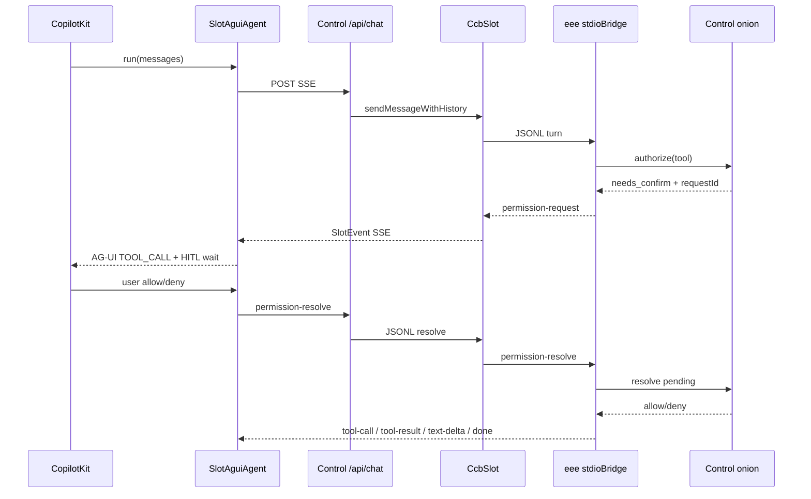

# CopilotKit / AG-UI Chat UI + 洋葱深 HITL（经 SlotEvent）

**日期：** 2026-10-02  
**状态：** Draft（设计已分段确认，待书面审阅）  
**分支：** `feat/agui-chat-ui-onion-hitl`  
**上游：** [Agent Slot + CCB stdio](./2026-07-17-harness-agent-slot-stdio-design.md)、[北极星](./2026-07-17-harness-control-console-north-star-design.md)、[洋葱能力门](./2026-07-28-onion-capability-gate-design.md)

## 目标

用 **CopilotKit（AG-UI 语义）** 替换 Web 主对话区 UI，同时把 Chat 路径上的洋葱 `needs_confirm` 做成 **同一条 agent run 上的深 HITL**（确认卡画在对话里，resolve 经 Slot 回传）。

- **线上协议仍是** Control `/api/chat` 的 **SlotEvent SSE**（甲）。
- **浏览器** 用薄适配器 `SlotAguiAgent` 把 SlotEvent ↔ AG-UI 事件，供 CopilotKit 消费。
- **洋葱只做裁决**（allow / deny / needs_confirm）；**AG-UI 不裁决**。
- **勾住的是 tool 调用**：eee/CCB → Control 洋葱；勾住后投影成 AG-UI HITL 给人点，再 resolve 回传。

## 已拍板决策

| 主题 | 选择 |
|------|------|
| UI 策略 | **B**：CopilotKit 组件做对话区（消息 / 工具 / HITL） |
| 线上协议 | **甲**：仍 `/api/chat` + `SlotEvent` SSE；不对外换标准 AG-UI HTTP |
| Agent loop | **仍 CCB**（`ask()` / QueryEngine）；不直连 LLM、不换 LangGraph |
| HITL 深度 | **深 3**：确认走协议中断，不靠独立 ConfirmBanner 作为 Chat 主路径 |
| 洋葱 vs AG-UI | 洋葱 = 裁决；AG-UI = 打断通道与 UI；二者不互通职责 |
| Chat 权限通道 | **经 Slot**：新增 `permission-request` / `permission-resolve`（相对旧 Slot 设计「权限不经 Slot」的有意修订，仅 Chat 路径） |
| 无头 / MCP Agent | **仍** `onion.authorize` + `onion.wait_resolve` + pending；行为不变 |
| CCB 不可用 | 显式 SSE `error`，不静默降级纯 LLM |

## 非目标

- Control 对外改成标准 AG-UI / CopilotRuntime HTTP（方案 3）
- 用 AG-UI 替换洋葱规则引擎或在浏览器本地裁决
- 换掉 CCB `ask()` / QueryEngine / stdio bootstrap
- 第一期把 slash skill、会话侧栏、headless 嵌页重写成 CopilotKit 原语
- 多 agent 池化、Remote Slot、subagent 嵌套 UI

## 架构

```text
apps/web
  Chat 外壳：会话侧栏 / 多 tab / slash skill / headless 嵌页 / chat-sessions 持久化
  └── CopilotKit（消息、工具卡、HITL 确认卡）
        └── SlotAguiAgent（AbstractAgent 适配）
              POST /api/chat              → SlotEvent SSE
              POST /api/chat/permission   → 同 session 回传 allow/deny

apps/control
  /api/chat          仍 SSE(SlotEvent)；keepalive 保留
  CcbSlot            转发 permission-request / permission-resolve
  洋葱               authorize 裁决；pendingStore 可落请求供审计/无头
  Chat 路径 UI       不再依赖 /api/pending/stream 弹窗

ccb（eee）stdioBridge / Chat 路径
  出：既有 SlotEvent + permission-request
  入：turn / abort + permission-resolve
  needs_confirm → 发 permission-request → 等 JSONL resolve（不堵 MCP wait_resolve）
  agent:dev MCP    → 仍 onion.wait_resolve
```



### 相对旧设计的修订

[Slot stdio 设计](./2026-07-17-harness-agent-slot-stdio-design.md) 写过「权限不经 Slot」。本设计对 **Web Chat 路径** 改为：确认打断经 SlotEvent 进出，以便一条 SSE 完成深 HITL。无头 MCP 路径仍不经 Slot 的 permission 事件。

## 事件映射

| SlotEvent | AG-UI（CopilotKit） | 说明 |
|-----------|---------------------|------|
| `text-delta` | `TEXT_MESSAGE_START/CONTENT/END` | 流式正文 |
| `tool-call` | `TOOL_CALL_START/ARGS/END` | 展示中的工具（已放行或进行中） |
| `tool-result` | `TOOL_CALL_RESULT` | 工具输出 |
| `permission-request`（新增） | HITL：`TOOL_CALL_*` + 等待用户 | 洋葱 `needs_confirm` 投影 |
| `done` | `RUN_FINISHED` | 一轮正常结束 |
| `error` | `RUN_ERROR` | 显式失败 |

### 新增 SlotEvent 形状（约定）

```ts
// packages/slot — 示意，实现以类型文件为准
| {
    type: 'permission-request'
    requestId: string
    toolName: string
    input: Record<string, unknown>
    message?: string
    sessionId: string
  }
```

回传契约（须同 session、带 `requestId`）：

- **浏览器 → Control：** `POST /api/chat/permission`（body 如下）；SSE 单向，不能靠同一 GET/POST chat 流回写。
- **Control → CCB：** 经 `CcbSlot` 写成 JSONL `permission-resolve`（同 shape）。

```ts
{
  type: 'permission-resolve'
  requestId: string
  decision: 'allow' | 'deny'
}
```

## Web 边界

| 保留（现有壳） | CopilotKit 接管 |
|----------------|-----------------|
| 会话侧栏、多 tab、`/api/chat-sessions` | 消息列表、流式气泡、工具卡 |
| `/` slash skill 插入输入框 | HITL 确认卡（深 3） |
| Chat 内嵌 headless 页 | — |
| 全局 `ConfirmBanner` | **Chat 主路径不用**；可保留给非 Chat / MCP 残留 pending |

`ChatPanel` 变薄：外壳管会话与 slash；对话区挂 CopilotKit + `SlotAguiAgent`。

## 错误处理

| 情况 | 行为 |
|------|------|
| 流中断 / 用户 abort | 与现 finalize 一致：中断提示，assistant incomplete；`abort` 经 Slot |
| 确认超时 | 与现 `wait_resolve` 超时一致 → **deny** + 可见错误，不静默放行 |
| 洋葱 deny | 工具失败结果进流；不出现「假允许」 |
| 未知 / 伪造 `requestId` | fail-closed：HTTP 4xx + 不执行 tool；流上可跟一条 `error` |
| CCB 不可用 | 显式 `error` SSE → `RUN_ERROR` |

## 测试（最小）

1. `SlotEvent ↔ AG-UI` 投影纯函数单测（含 `permission-request`）。
2. Control：`permission-resolve` 解开 Chat 等待；乱 `requestId` / 超时 fail-closed。
3. CCB Chat 路径：`needs_confirm` 发 `permission-request` 并等 JSONL；MCP 路径仍 `wait_resolve`。
4. Web：HITL allow / deny 各一条（mock slot / 组件测）。

## 实现落点（概览，细节见后续 plan）

| 区域 | 改动 |
|------|------|
| `packages/slot` | 扩展 `SlotEvent`；文档化 resolve 契约 |
| `apps/control` `CcbSlot` / chat 路由 | 转发 permission；新增 `POST /api/chat/permission` |
| `ccb/src/harness` | Chat 路径：authorize 后发 request、等 resolve；MCP 路径不动 |
| `apps/web` | 引入 CopilotKit；`SlotAguiAgent`；瘦身 `ChatPanel`；Chat 路径去 ConfirmBanner 依赖 |
| 依赖 | `@copilotkit/*` / `@ag-ui/*`（版本在 plan 锁定） |

## 验收标准

- Web Chat 用 CopilotKit 展示流式文本与工具；发送仍经 `/api/chat` → CCB。
- 洋葱 `needs_confirm` 时对话内出现 HITL；allow 后 tool 继续；deny/超时不执行。
- `/api/chat` 线上仍为 SlotEvent SSE（可含新 `permission-request`）。
- `agent:dev` / MCP `wait_resolve` 回归通过。
- 无「浏览器放行即跳过洋葱」的路径。
